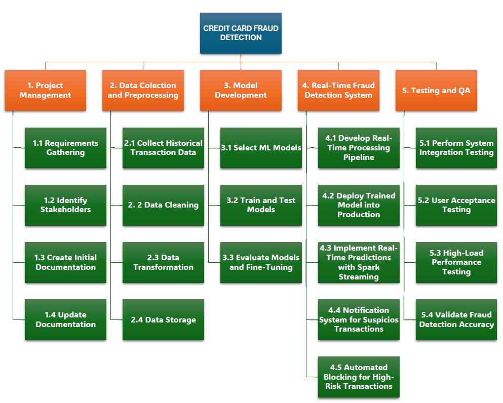

# Credit Card Fraud Detection

## 1. Introduction

Credit card fraud is a critical challenge for financial institutions, causing significant financial losses and reputational damage. This project aims to develop a machine learning-based fraud detection system that can identify and prevent fraudulent transactions in real-time. By leveraging advanced data analytics and anomaly detection techniques, the system will help reduce financial losses, improve customer trust, and enhance the bank's security measures.

*February 15th, 2025*

*Current Version: 1.0*

*Project Manager (and sponsor): Marcel Jar*

## 2. Overview

Build a machine learning model using historical transaction data to detect fraudulent credit card activities and integrate the model into a real-time fraud detection system.

### 2.1 Objective

The primary objective of this project is to develop an automated, real-time fraud detection system using machine learning models to minimize fraudulent transactions. The system will be trained on a comprehensive dataset of credit card transactions, utilizing both supervised learning algorithms (e.g., logistic regression and decision trees) and anomaly detection techniques (e.g., isolation forests and one-class SVM). The model will be optimized for accuracy and efficiency through preprocessing techniques, including data normalization, handling class imbalances, and feature engineering. The project will also implement a real-time processing pipeline using Spark to evaluate transactions instantly and flag suspicious activities. This initiative will reduce financial losses, enhance customer confidence, and support the bank’s security operations.

### 2.1 Work Breakdown Structure

### 2.2 Gantt Chart

## 3. Milestones

1. **Project Initiation**: Approve project scope, resources, and timeline.
2. **Data Collection and Preprocessing**: Collect and clean historical transaction data, address imbalances.
3. **Model Development**: Develop and train supervised and anomaly detection models.
4. **Model Evaluation and Tuning**: Evaluate performance and optimize model parameters.
5. **Real-Time System Integration**: Integrate the model into a real-time transaction pipeline.
6. **Testing and QA**: Conduct integration and performance testing.
7. **Deployment**: Deploy the model into the production environment.

## 4. Deliverables

1. **Project Charter**: Outlines project objectives, scope, and stakeholders.
2. **Stakeholder List**: Identifies key project stakeholders and their roles.
3. **Preprocessed Dataset**: Cleaned and structured data ready for model training.
4. **Data Quality Report**: Documents data preprocessing steps and quality checks.
5. **Trained Models**: Machine learning models trained on historical data.
6. **Model Training Report**: Details the model development process and algorithms used.
7. **Model Evaluation Report**: Summarizes model performance metrics and results.
8. **Real-Time Processing Pipeline**: Functional system for real-time transaction analysis.
9. **Integration Report**: Documents the integration of models into the real-time pipeline.
10. **Test Results**: Results from system integration and performance testing.
11. **QA Report**: Quality assurance findings and resolutions.
12. **Deployed System**: Fully operational fraud detection system in production.

## 5. Preliminary Budget

| **Role**            | **Daily Rate** | **Allocation (%)** | **Sprint Burn Rate** |
|---------------------|----------------|---------------------|---------------|
| Scrum Master        | $300           | 50%                | $1,500.00        |
| Data Analyst 1      | $100           | 100%               | $1,000.00        |
| Data Analyst 2      | $100           | 100%               | $1,000.00        |
| QA Specialist       | $150           | 50%                | $750.00          |
| **Total**           |                |                    | **$4,250.00**    |

## 5.2 Total Personnel Cost

| **Description**           | **Value** |
|---------------------------|-----------|
| Sprint Burn Rate     | $4,250.00    |
| Number of Sprints         | 6         |
| **Total**  | **$25,500.00** |

## 5.3 Fixed Cost

| **Item**                  | **Qty** | **Cost/Item** | **Total Cost** |
|---------------------------|---------|---------------|----------------|
| Computer Hardware         | 2  (units)     | $750.00          | $1,500.00           |
| Databricks                | 3 (months)       | $80.00           | $240.00            |
| **Total**     |                |               | **$1,740.00**       |

## 5.4 Contingency

| **Description**       | **Percentage** | **Personnel _ Fixed costs** | **Total Contingency** |
|-----------------------|----------------|------------------------|-------------------------|
| Contingency Funds      | 15%            | $27,240.00               | **$4,086.00**                 |

## 5.5 Total Estimated Cost

| **Cost Category**              | **Amount**   |
|--------------------------------|--------------|
| Total Personnel Cost          | $25,500.00      |
| Total Fixed Cost              | $1,740.00        |
| Total Contingency (15%)        | $4,086.00      |
| **Total Estimated Cost**      | **$31,326.00**  |

## 6. Organization and Stakeholders

## 7. Risks Assumptions and Constratins
